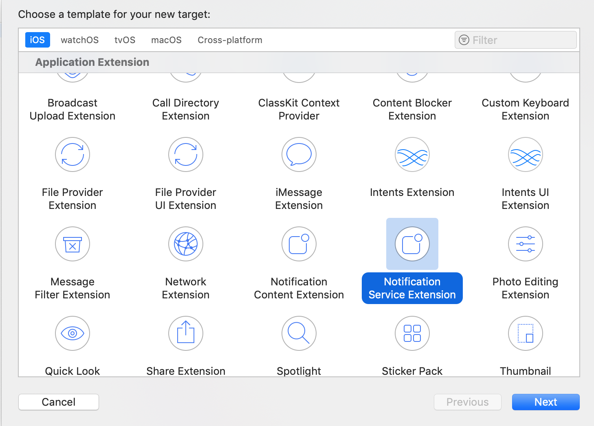

# Dengage.Framework

## Requirements

* Dengage Integration Key
* iOS Push Cerificate
* iOS Device ( you must test on real device for notifications)
* A mac with latest Xcode

## Installation

Dengage.Framework is available through [CocoaPods](https://cocoapods.org). To install
it, simply add the following line to your Podfile:

```ruby
pod 'Dengage.Framework'
```

## Author

ekin@whitehorse.technology

## License

Dengage.Framework is available under the GNU General Public License v3.0 license. See the LICENSE file for more info.

***Dengage.Framework*** provides necessary classes and functions which handles notification registration and sending open events to developer.  Also it gives classes to send subscription events to dengage infrastructure.

Supports 11.0+

## 1. Add Notification Service Extention

1.1 In Xcode Select ```File``` > ```New``` > ```Target```

1.2 Select ```Notification Service Extension``` then press ```Next```.



1.3 Enter the product name as ```DengageNotificationServiceExtension``` and press ```Finish```.


1.4 Press Cancel on the Activate scheme prompt.


1.5 Open ```NotificationService.swift``` and replace the whole file contents with the below code.

```swift

    import Dengage_Framework // import sdk

    override func didReceive(_ request: UNNotificationRequest, withContentHandler contentHandler: @escaping (UNNotificationContent) -> Void) {
        self.contentHandler = contentHandler
        bestAttemptContent = (request.content.mutableCopy() as? UNMutableNotificationContent)
         
        if let bestAttemptContent = bestAttemptContent {
            // Modify the notification content here...
           
            Dengage.didReceiveNotificationExtentionRequest(receivedRequest: request, with: bestAttemptContent)
            contentHandler(bestAttemptContent)
        }
    }

```

## 2. Add Required Code

Navigate to the AppDelegate file and add the following ```Dengage``` initialization code to ```didFinishLaunchingWithOptions```.

```swift
    import Dengage_Framework // import sdk

    func application(_ application: UIApplication, didFinishLaunchingWithOptions launchOptions: [UIApplication.LaunchOptionsKey: Any]?) -> Bool {
        
        do {
            
            Dengage.setDengageIntegrationKey(key: "dengage-integration-key")
            try Dengage.initWithLaunchOptions(withLaunchOptions: launchOptions, badgeCountReset: true)
            // add this to ask for user permission
            Dengage.promptForPushNotifications()
            
        } catch let error {
            // handle error
        }

       return true
    }

```

Note: if you prefer not to use ```promptForPushNotifications``` method, you should inform sdk about user permission by using ```setUserPermission(permission: BOOL)``` method.

```swift
    import Dengage_Framework // import sdk

    func application(_ application: UIApplication, didFinishLaunchingWithOptions launchOptions: [UIApplication.LaunchOptionsKey: Any]?) -> Bool {
        
        do {
            
            Dengage.setDengageIntegrationKey(key: "dengage-integration-key")
            try Dengage.initWithLaunchOptions(withLaunchOptions: launchOptions, badgeCountReset: true)
            // ask for user permission, and send permission status either false or true
            Dengage.setUserPermission(true)
            
            
        } catch let error {
            // handle error
        }

       return true
    }

```

Navigate to the AppDelegate file and the following ```Dengage``` code to ```didRegisterForRemoteNotificationsWithDeviceToken```

```swift 


    func application( _ application: UIApplication, didRegisterForRemoteNotificationsWithDeviceToken deviceToken: Data) {
        
        let tokenParts = deviceToken.map { data in String(format: "%02.2hhx", data) }
        let token = tokenParts.joined()
        print("Device Token: \(token)")
        
        // token is the push token where you get from apple servers after registration
        Dengage.setToken(token: token)
    }

```
## 3. Sending Subscription events to Dengage

To send subscription event add the following code to whereever you register your user

#### Note: setContactKey is optional, you may only use SendSubscriptionEvent function

```swift
        import Dengage_Framework

        func someFunction(){

            Dengage.setContactKey(contactKey: email_textbox.text ?? "")
            let result = Dengage.SyncSubscription()
                
            if(result){ 
                message.text = "Registered Successfully"
            }
        }

```

## 4. ContactKey

ContactKey represents the information of a user; like email address, fullname or any other kind of string which has registered to your application. To set a contact key, call ```setContactKey``` function

```swift
        func someFunction(){

            Dengage.setContactKey(contactKey: email_textbox.text ?? "")
            
        }
```

## 5. Logging

SDK logs any important operation by using logs. In default, logs will not be displayed. To enable logs call ```setLogStatus``` method.

```swift
        func someFunction(){

            Dengage.setLogStatus(isVisible: true)
            
        }
```

# Event Collection

## Requirements

* Dengage.Framework


### 1. Sending DeviceEvent

```swift

        let eventDetails:NSDictionary = ["event_type":ADD_BASKET, "product_id":strProductID, "quantity": 1]

        Dengage.SendDeviceEvent(toEventTable: EVENT_TABLE_NAME, andWithEventDetails: eventDetails)

```

### 2. Sending CustomEvent

```swift

        let eventDetails:NSDictionary = ["event_type":ADD_BASKET, "product_id":strProductID, "quantity": 1]

        Dengage.SendCustomEvent(toEventTable: EVENT_TABLE_NAME, withKey:"custom-key" andWithEventDetails: eventDetails)

```


