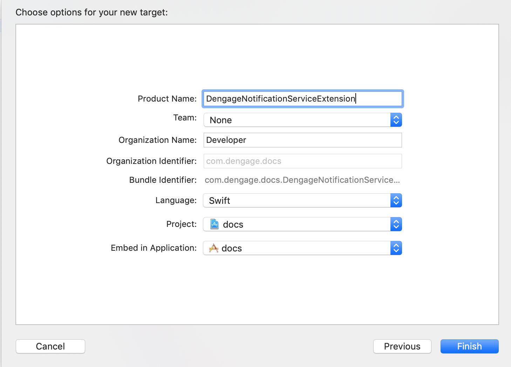

# Dengage.Framework

## Requirements

* Dengage Integration Key
* iOS Push Cerificate
* iOS Device ( you must test on real device for notifications)
* A mac with latest Xcode
* Supports min version 10 or higher

## Installation

Dengage.Framework is available through [CocoaPods](https://cocoapods.org). To install
it, simply add the following line to your Podfile:

```ruby
pod 'Dengage.Framework'
```

## License

Dengage.Framework is available under the GNU General Public License v3.0 license. See the LICENSE file for more info.

***Dengage.Framework*** provides necessary classes and functions which handles notification registration and sending open events to developer.  Also it gives classes to send subscription events to dengage infrastructure.

Supports 11.0+

## 1. Add Notification Service Extention

1.1 In Xcode Select ```File``` > ```New``` > ```Target```

1.2 Select ```Notification Service Extension``` then press ```Next```.


1.3 Enter the product name as ```DengageNotificationServiceExtension``` and press ```Finish```.



1.4 Press Cancel on the Activate scheme prompt.


1.5 Open ```NotificationService.swift``` and replace the whole file contents with the below code.

```swift

    import Dengage_Framework // import sdk

    override func didReceive(_ request: UNNotificationRequest, withContentHandler contentHandler: @escaping (UNNotificationContent) -> Void) {
        self.contentHandler = contentHandler
        bestAttemptContent = (request.content.mutableCopy() as? UNMutableNotificationContent)
         
        if let bestAttemptContent = bestAttemptContent {
            // Modify the notification content here...
           
            Dengage.didReceiveNotificationExtentionRequest(receivedRequest: request, with: bestAttemptContent)
            contentHandler(bestAttemptContent)
        }
    }

```

### Note : While sending push notifications, Dengage senders puts a messageSource to the message payload. Notification messages will handle if messageSource has the value of DENGAGE.

## 2. Add Required Code

Navigate to the **AppDelegate** file and add the following ```Dengage``` initialization code to ```didFinishLaunchingWithOptions```.

```swift
    import Dengage_Framework // import sdk

    func application(_ application: UIApplication, didFinishLaunchingWithOptions launchOptions: [UIApplication.LaunchOptionsKey: Any]?) -> Bool {
        
        
       // set integration key
       Dengage.setDengageIntegrationKey(key: "dengage-integration-key")
       
       Dengage.useCloudForSubscription(enable: true)
        
       Dengage.initWithLaunchOptions(withLaunchOptions: launchOptions, badgeCountReset: true)
            
       // add this method to ask for user permission
       Dengage.promptForPushNotifications()


       return true
    }

```

**Note:** If you prefer not to use ```promptForPushNotifications``` method, you should inform sdk about user permission by using ```setUserPermission(permission: BOOL)``` method.

**Note:** ```Dengage.promptForPushNotifications``` function also has callback function if you want to be notified if user granted.

```swift
    import Dengage_Framework // import sdk

    func application(_ application: UIApplication, didFinishLaunchingWithOptions launchOptions: [UIApplication.LaunchOptionsKey: Any]?) -> Bool {
        
       
       // set integration key     
       Dengage.setDengageIntegrationKey(key: "dengage-integration-key")
       
       Dengage.useCloudForSubscription(enable: true)
       
       Dengage.initWithLaunchOptions(withLaunchOptions: launchOptions, badgeCountReset: true)
       
       
       ...{
           // ask for user permission, and send permission status either false or true
           Dengage.setUserPermission(true)
           
           // sends subscription event
           Dengage.SyncSubscription()
       }

       
       return true
    }

```

Navigate to the **AppDelegate** file and add the following ```Dengage``` code to ```didRegisterForRemoteNotificationsWithDeviceToken```

```swift 
    func application( _ application: UIApplication, didRegisterForRemoteNotificationsWithDeviceToken deviceToken: Data) {
        
        let tokenParts = deviceToken.map { data in String(format: "%02.2hhx", data) }
        let token = tokenParts.joined()
        print("Device Token: \(token)")
        
        Dengage.setToken(token : token)
        
    }
```

**Note:** If you want SDK **not to manage** remote notification registration; set  ```registerForRemoteNotifications``` to false, you need to implement ```UIApplication.shared.registerForRemoteNotifications()```

## 3. Subscription

```swift
Dengage.SyncSubscription()
```

*Note:* ```Dengage.promptForPushNotifications()```  method will automatically sends subscription event. Otherwise; implement ```Dengage.SyncSubscription()``` method.

## 4. ContactKey

```swift
Dengage.setContactKey(contactKey: email_textbox.text ?? "")
```

ContactKey represents the information of a user; like email address, fullname or any other kind of string which has registered to your domain. To set a contact key, call ```setContactKey(contactKey: String)``` function

## 5. Logging

```swift
Dengage.setLogStatus(isVisible: true)
```

SDK logs any important operation by using logs. In default, logs will not be displayed. To enable logs call ```setLogStatus(isVisiable : BOOL)``` method.

## 6. Callback Methods

```swift
Dengage.HandleNotificationActionBlock(callback: @escaping (_ notificationResponse : UNNotificationResponse)-> ())
```

When a notification opened  ```Dengage.HandleNotificationActionBlock``` method returns ```UNNotificationResponse```.

You can access to ```UNUserNotificationCenterDelegate``` callback with ```HandleNotificationActionBlock``` method. Callback object is type of ```UNNotificationResponse```

*Sample Usage:*
```swift

    Dengage.HandleNotificationActionBlock { (notificationResponse) in
                
                
                let messageDetails = notificationResponse.notification.request.content.userInfo["messageDetails"] as! String;
                let messageId = notificationResponse.notification.request.content.userInfo["messageId"] as! Int;
                
                print(messageDetails)
                print(String(messageId))
            }


```

## 7. Deeplinking

SDK supports URL schema deeplink. If target url has a valid  link, it will redirect to related link.

* [Apple URL Scheme Deeplinking](https://developer.apple.com/documentation/uikit/inter-process_communication/allowing_apps_and_websites_to_link_to_your_content/defining_a_custom_url_scheme_for_your_app)

* [Apple Universal Link](https://developer.apple.com/documentation/uikit/inter-process_communication/allowing_apps_and_websites_to_link_to_your_content)


## 8. Action Buttons

Action buttons can be pre-defined or can be defined on CDMP interface.
IOS Action buttons can be defined up to four buttons. 

Custom Action Buttons can contain target url links.


# Event Collection

## Requirements

* Dengage.Framework

Framework provides Event Methods for integration.

**Note:** *Before sending an event, Dengage.Framework opens a Session by defualt. But according to implementation, developer can able to open a session manually.*

#### 1. ``` DengageCustomEvent.shared.StartSession(location: String) ```

- Parameter location : *deeplink (page link)*

```swift
    DengageCustomEvent.shared.StartSession(location: location)
```


### PageView Events

#### 1. ``` DengageCustomEvent.shared.PageView(params : NSMutableDictionary) ```

- Parameter params : NSMutableDictionary

```swift
//category
DengageCustomEvent.shared.PageView(params: ["page_type":"category","category_id":"1"])

//product page view
DengageCustomEvent.shared.PageView(params: ["page_type":"product","product_id":"1"])

//promotion page view
DengageCustomEvent.shared.PageView(params: ["page_type":"promotion","promotion_id":"1"])

//login page view
DengageCustomEvent.shared.PageView(params: ["page_type":"login"])

//logout page view
DengageCustomEvent.shared.PageView(params: ["page_type":"logout"])

//welcome
DengageCustomEvent.shared.PageView(params: ["page_type":"welcome"])

//custom page view
DengageCustomEvent.shared.PageView(params: ["page_type":"custom"])

```

### Cart Events

To send a cart event, a cart item must be created before sending as a pramater to function.

```
var cartItem = [:] as NSMutableDictionary

cartItem["product_id"] = 1
cartItem["product_variant_id"] = 1
cartItem["quantity"] = 1
cartItem["unit_price"] = 10.00
cartItem["discounted_price"] = 9.99

let cartItems = [] as [NSMutableDictionary]
cartItems.append(cartItem)

```


#### 1. ```DengageCustomEvent.shared.AddToCart(params : NSMutableDictionary)```


```
var params = ["product_id":1,
              "product_variant_id":1,
              "quantity":1,
              "unit_price":10.00,
              "discounted_price":9.99
              "cartItems":cartItems]

DengageCustomEvent.shared.AddToCart(params : params)
```

#### 2. ```DengageCustomEvent.shared.RemoveFromCart(params : NSMutableDictionary)```

```
var params = ["product_id":1,
              "product_variant_id":1,
              "quantity":1,
              "unit_price":10.00,
              "discounted_price":9.99
              "cartItems":cartItems]

DengageCustomEvent.shared.RemoveFromCart(params : params)
```

#### 3. ```DengageCustomEvent.shared.ViewCart(params : NSMutableDictionary)```

```
var params = ["cartItems":cartItems]
DengageCustomEvent.shared.ViewCart(params : params)
```

#### 4. ```DengageCustomEvent.shared.BeginCheckout(params : NSMutableDictionary)```

```
var params = ["cartItems":cartItems]
DengageCustomEvent.shared.BeginCheckout(params : params)
```

### Order Events

#### 1. ```DengageCustomEvent.shared.Order(params : NSMutableDictionary)```

```
var params = ["order_id":1,
              "item_count":1,
              "total_amount":1,
              "payment_method":"CARD",
              "shipping":5,
              "coupon_code":"",
              "discounted_price":9.99
              "cartItems":cartItems]
              
              
DengageCustomEvent.shared.Order(params : params)
```

### Search Event

#### 1. ```DengageCustomEvent.shared.Search(params : NSMutableDictionary)```

```
var params = ["keywords":"some product name",
              "result_count":12,
              "filters":""]
              
              
DengageCustomEvent.shared.Search(params : params)
```

### WishList Events


```
var wishListItem = [:] as NSMutableDictionary
wishListItem["product_id"] = 1

let wishListItems = [] as [NSMutableDictionary]
wishListItems.append(wishListItem)

```


#### 1. ```DengageCustomEvent.shared.AddToWithList(params : NSMutableDictionary)```


```
var params = ["product_id":1,
              "items":wishlistItems]
              
              
DengageCustomEvent.shared.AddToWithList(params : params)
```

#### 2. ```DengageCustomEvent.shared.RemoveFromWithList(params : NSMutableDictionary)```


```
var params = ["product_id":1,
              "items":wishlistItems]
              
              
DengageCustomEvent.shared.RemoveFromWithList(params : params)
```
